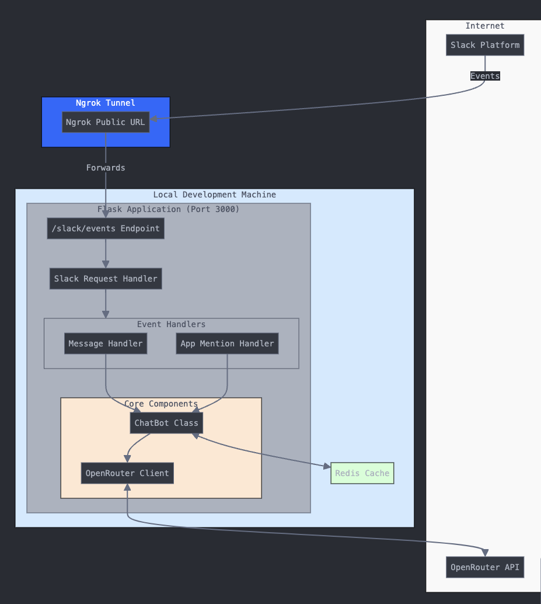

# Arka's Droid

A Slack bot powered by mistral-small-24b LLM that generates contextual responses in channels. Built as a part of the doctor droid backend engineer assignment.

## Features

-   🤖 Responds to mentions in Slack channels
-   💾 Maintains conversation context (5 recent messages)
-   📜 Command to show last 5 messages
-   🧠 Smart responses via OpenRouter API
-   ⚙️ Easy configuration and deployment

## Architecture Diagram



## Prerequisites

-   Slack Workspace with Bot Token (`SLACK_BOT_TOKEN`)
-   Redis server for conversation storage
-   OpenRouter API key (`OPENROUTER_API_KEY`)
-   Python 3.8+
-   ngrok installed for local development (Optional, but recommended for testing)

## Slack Bot Token Setup

1. Go to [Slack API](https://api.slack.com/apps)
2. Click "Create New App" and choose "From scratch"
3. Name your app and select your workspace
4. Under "Basic Information", note your App ID
5. Go to "OAuth & Permissions":
    - Add these bot token scopes:
        - `app_mentions:read`
        - `channels:history`
        - `chat:write`
        - `im:history`
6. Install app to workspace
7. Copy the "Bot User OAuth Token" - this is your `SLACK_BOT_TOKEN`

## Installation

1. Clone the repository:

```bash
git clone https://github.com/arka-bhat/arka-droid.git
```

2. Install dependencies:

```bash
pip install -r requirements.txt
```

3. Configure environment variables in `.env`:

```env
SLACK_BOT_TOKEN=your_token_here
OPENROUTER_API_KEY=your_key_here
```

4. Start the bot:

```bash
python app.py
```

The server will start on port 3000.

## Using ngrok for Local Development

To allow Slack to communicate with your local machine, you'll need to expose your local Flask app to the public internet using ngrok.

### Steps to Set Up ngrok:

1. Install ngrok (if you don't already have it installed):

-   Download ngrok via `brew install ngrok` (on macos) and follow the installation instructions for your operating system.

2. Start ngrok:

-   Open a new terminal window and run ngrok to tunnel port 3000 (or whichever port your Flask app is running on):

    `ngrok http 3000`

3. After starting ngrok, you'll see an output with a public URL like https://xxxxxx.ngrok.io.

-   Update Slack Event Subscriptions:

          -   Go to your Slack App configuration page and select your bot app.
          -   In the Event Subscriptions section, set the Request URL to the ngrok URL you just generated. It should look something like:
                https://xxxxxx.ngrok.io/slack/events

4. Test the Bot:

-   Now, Slack can send events to your local machine via ngrok. You should be able to test your bot in your Slack workspace, and it will respond based on the messages sent to the bot.

## Usage

-   @mention the bot to get responses (Example: `Hello @Arka's Droid, what is capital of US`)
-   Type `list my last 5 messages` to see recent conversation
-   Bot maintains context for each channel/thread
